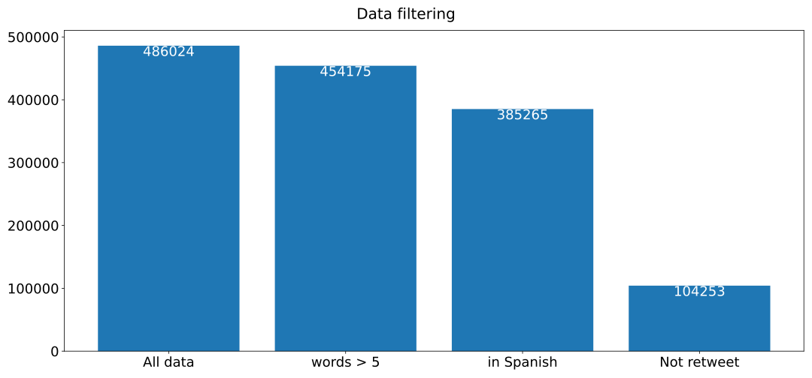

# Method
> The performance of a text retrieval system is highly dependent on the quality of the internal document representations. Those document representations are generated from the document’s text by a so-called embedding algorithm, which “embeds” the documents as points into a space with a particular fixed dimensionality. This space is also called a latent semantic space, because its dimensions are potentially/latently representing particular semantic concepts.

The idea of this method is to group tweets into meaningful clusters by using language modelling and Hierarchical Density clustering methods. The output of these clusters is then studied with classical TF-IDF before manually labelling them into meaningful categories.
Added to this topic analysis, a toxicity metric is build using external service (ConversationAI) to obtain a toxicity score to each tweets presents in the analysis.
The results is then used to analyse difference in communication behaviours among Spanish Representatives on Twitter, using which type of topic they are talking about, what it is the evolution of it and in which extend the communication can be toxic or not.

Data collection is done through the Twitter REST API access @QXJ96E9H#No_Author__Standard and the Stream API access @NZ6ABJV9#No_Author__Connecting. The full tweet object (Tweet Object, n.d.). are downloaded and then pushed into a MongoDB database. The entire process use Python and while the access to the REST API relies on in-house code, the Stream AI access is done using Tweepy library[^tweepy_url].
[^tweepy_url]: [https://www.tweepy.org/](https://www.tweepy.org/)
The connection with MongoDB is done using the Pymongo client[^pymongo_url], while the database is stored in a university virtual machine.
[^pymongo_url]: [https://pypi.org/project/pymongo/](https://pypi.org/project/pymongo/)

### Data cleaning

From the collected tweets, the entities are first analysed. The different entities are the retweet, mentions, hashtags and URLs.
Using these fields, we can remove from every tweets any ‘RT’ symbols, mentions, URLs and the symbol ‘#’. For the hashtags we kept the text itself.
This first preprocessing steps ensure we have only text information to be analysed further.
The practical implementation is done through REGEX search and replace from the tweet text. To keep the entities in a separated list we used the list provided with the Tweet object.
Twitter can be multilingual and Spain has several official languages. However we are interested only in Spanish as this analysis is about the entire country and the tweets need to be understood by everyone in Spain.
Therefore, we identified the language of the tweets. Twitter offers that possibility in the tweet object under the field ‘lang’. However, to get more control over how the language are detected and which tweet to included we used Fasttext[^fasttext_url]a @CN8N62R2#Joulin_Etal_2016_Fasttext.
[^fasttext_url]: [https://fasttext.cc/](https://fasttext.cc/)
This library detects which are the most probable language from a piece of text and output a probability score. To ensure we included tweets that were clearly written in Spanish, we only kept the tweets that had a score equal or above of 0.6 in the Spanish language.
The remaining tweets were then transformed into lower case and punctuation removed. Furthermore, any tweet that had less than 5 word left after stopword being removed using Gensim[^gensim_ur] @HXZYGYH7#Řehůřek_Sojka_2010_Software were removed from the dataset. valuable to analyse.
[^gensim_url]: [https://radimrehurek.com/gensim/](https://radimrehurek.com/gensim/)
They were often just link sharing or really short reactions and we discarded these tweets as they will not contain any text.
Lastly we removed all the tweets that are detected as retweet. We were only interested in the original content and removing retweet ensure we only have what the representative are writing.
The final dataset is then transformed into a set of sentence embeddings to be fed into a clustering algorithm.

### Sentence embeddings

Natural Language Processing (NLP) has seen recent key innovations with language modelling that permitted the field to reach similar outbreaks as in computer vision.
One of the most crucial development was the release of Transformer-based models using the Google Bidirectional Encoder Representations from Transformers (BERT) @AABRZUJ4#Devlin_Etal_2019_Bert.
Since that release, several improvements have been done [REF] [REF] but the principle remains the same; the models are trained on huge unlabelled text datasets (often wikipedia) using attention network with Masked Language Model or Next Sentence Prediction.

The obtained language models have more ability to capture semantic representation of the words and are much more potent than old techniques used for word embedding such as GloVe [REF], Word2vec [REF] or ELMO [REF].

Not only these language models are superior, they also gained more ability by being pre-trained on various datasets and extended their domain of application on other languages than English @ELJGJCQP#Pires_Schlinger_Garrette_2019_How.
The resulting models can then be used and fined tuned to downstream tasks such as classification, text generation, sentiment analysis and so on but unsupervised tasks can also benefit from them. It is  possible to use BERT for feature extraction by using the word embedding from the hidden states of the pretrained model.
Clustering, implies some similarity metrics between sentences or documents. Using this embeddings.
It is possible to pool them and take the average of all the words embedding from the document/sentence to create a document/sentence embedding.
Some external library exists using this technique @VIPJTPB2#Xiao_2018_Bertasservice and have been used in the past for clustering @XMYGVFB8#Aharoni_Goldberg_2020_Unsupervised, @DV6UKH8K#Curiskis_Etal_2020_An.

Another approach was developed by Reimers and Gurevych by fine tuning a model on sentence similarity @RT5KN6K7#Reimers_Gurevych_2019_Sentencebert.
Later than developed a multilingual versions which allow to use with Spanish as input language @A5L7WADI#Reimers_Gurevych_2020_Making. This is their model used here in combination with their implementation in python[^sent_trans_url].
[^sent_trans_url]: [https://github.com/UKPLab/sentence-transformers](https://github.com/UKPLab/sentence-transformers)

We transformed every tweet into a vector fo 512 dimensions, using the default pooling method (mean) and using the Multilingual knowledge distilled version of multilingual Universal Sentence Encoder (Yang et al., 2019). We fit the Siamese model on a Google Colaboratory instance[^colab_url] to leverage the access to GPU/TPU.
[^colab_url]: [https://colab.research.google.com/](https://colab.research.google.com/)
At the end of this step we obtained an array of vectors representing all the tweets selected from our original set.

### Dimensionality reduction

Before applying a clustering algorithm on the embedding created by the transformer, we have to reduce the number of dimensions from 768 (the default size of an embedded document from the sentence-transformer), to a more manageable number of dimensions.
This is to avoid the curse of dimensionality[^curse].
[^curse]: The curse of dimensionality refers to either the problem of data spareness or the problem in distance between vectors. In high dimension space all vectors will appear to be equidistant, thus rendering clustering difficult.

To reduce the number of dimensions, it is possible to use autoencoders or dimensionality reduction algorithm such as PCA @3A6UER6L#Ljungberg_2017_Dimensionality, t-SNE @UUFFGRBX#VanDerMaaten_2014_Accelerating or UMAP @XIZNY7K6#Mcinnes_Healy_Melville_2020_Umap.

We used the last option as it has shown good results in the past, especially with HDBSCAN clustering algorithm @CQPGRTKJ#Allaoui_Kherfi_Cheriet_2020_Considerably.
Concretely, we passed the obtained sentence embeddings into the algorithm using the python library to reduce their dimensions to a more manageable 50 dimensions[^nbr_dim].
[^nb_dim]: In their documentation, the HDBSCAN authors point out that their algorithm works better in a dimension space between 50 and 100 dimensions. We tested different level of dimension reduction and 50 dimensions seems to be lower enough to offer good performance while not losing too much information when clustering.

### Clustering

Clustering is effective method to gain more insight on huge dataset. It can be used to regroup documents into pre-defined number of topics, or letting the algorithm decide how many topic exists. Cluster analysis dramatically evolves in the past years with the apparition of new methods. From the traditional k-means clustering, the research shift to density clustering algorithms such as OPTICS, DBSCAN or HDBSCAN @BJMW2VLU#Ankerst_Etal_1999_Optics, @WKZWLDBE#RupankaBhuyan_SamarjeetBorah_2013_Survey, @E4D9F2WI#Ester_Kriegel_Xu_1996_Densitybased.

Over k-means, they offer the possibility to deal with non spherical clusters and therefore give more arbitrary shape than then spherical shape obtained with K-mean.

A second advantage is they do not require to specify a fixed number of clusters and finally, they have the notion of noise, some point of data can not belong to any clusters.
We used HDBSCAN as it offers a better version of DBSCAN (on which it is based) as it can detect clusters of varied density but also is faster in performance.
The HDBSCAN also requires to set up some hyper parameters, the cluster size (how big a cluster need to be to be formed and not considered as noise) and the min sample size (which is the distance between point to be included in a cluster).

ADD DIMENSIONS

ADD GRID SEARCH

To choose the hyper parameters, several runs are done with different values and the clustering that seems the most reliable (by manual analysis) is retained. To manually analysed, we relied on TF-IDF (which is also used to label and decide what the clusters represent).

Once we obtained the clusters they are still composed of thousands of tweets. In information retrieval, term frequency-inverse document frequency (TFIDF) is a numerical statistic to extract the most relevant word in a document.
We can then visualise the content of the different clusters with the top n most relevant words from the cluster.

### Toxicity detection: Google version

Toxicity can be understood as a `rude, disrespectful or unreasonable messages that are likely to make a person to leave a discussion` (@GJ6PVV9N#Fortuna_Nunes_2018_Survey, p.8) and for the author, can be considered as different as Abusive language or Profanity.
We have used the Jigsaw API @UVGEP6VQ#No_Author__Conversation, @PUWUB6T2#Wulczyn_Thain_Dixon_2017_Ex  which is has been previously used to detect toxicity in online community @Z3TXB2YJ#Miller_Etal_2017_What, @JPHI73QC#Mittos_Etal__And and for the COVID on Twitter specifically @2Z9Z55U7#MajóVázquez_Etal_2020_Volume.
This API can detect and quantify the toxicity of a text in multiple language. Currently 6 languages are supported, among which one the Spanish. We passed the text without the entities to their API.
The API returns a score from 0 to 1 to each associated tweet, indicating the level of toxicity. It reflects the percentage of human coders that judge comments as toxic (for the training set used by the classifier) and represents the likelihood a comment is considered as toxic.

### Potential improvements

The main point of the methodology is to use Transformer-based models to get sentence embeddings.
The pretrained language model used was trained on wikipedia corpus, aligned in other language than English and then fine-tuned for the sentence similarity as down task @A5L7WADI#Reimers_Gurevych_2020_Making.
This method has reported better results than using a traditional pooling method of word embedding to create the sentence embeddings.
However, it uses a generic pretrained model and we could domain-specific pretrained our own model on our Tweets datasets. We will lose the pretraining on sentence similarity but it would be possible to use simple pooling as seen in other researches [REF].

Currently, the method to choose the right clusters is based on manual analysis of the results. However, it is possible to use metrics even for density based clusters @JWUYVYE6#Moulavi_Etal_2014_Densitybased. It should be implemented in the pipeline, using the appropriate tools from the HBDSCAN library[^validity].
[^validity]: They included a validity_index function which implement the methodology developed in the Moulavi et al. article.

# Results

### Data collection

We gathered the tweet accounts of all Spanish representatives (when they
were present on Twitter). The data was collected everyday from the
01/01/2020 to the 01/09/2020. This period encompasses the Spanish
lockdown, as well as 30 days prior to it and 30 days after. Our data
collection is larger but limiting the period around the lockdown ensure
the discussion where mainly about it and the COVID-19, rather than other
subjects.

The data collection collected all the tweets published by the elected
deputies in Spanish Government, when they had a Twitter account and they
tweeted during the period of collection.

We collected a total 486024 tweets (including retweets). These tweets
were preprocessed which consequently reduced the size of the sample
(Table
X).

{#fig:data-filtering}

After removing the tweets that had less than 5 words in it (reducing the
dataset to 454175) were not identified as Spanish language with a
probability equal or superior to 0.6 (reducing further to 385265 tweets)
and the tweets that were flagged as retweet, the final dataset contained
104253 tweets (see TableX).

These tweets were from 270 users[^1] and the full list among the number
of tweets in the final dataset can be found in the [Annex](#annex) X.

As we were only interested in the main parties, we group them according
to their party affiliation. We only kept the 5 most important parties
(PSOE, Cs, PP, VOX, UP) and regrouped all others into the category
Others (see TABLE1).

  party_5   Nbr of tweets   Nbr of users
  --------- --------------- --------------
  Cs                        9
  Other                     33
  PP                        72
  PSOE                      90
  UP                        32
  VOX                       37

Table: Number of tweets and users per party. {#tbl:users-tweets}

From these tweets we cleaned and extracted the embedding as developed in
the

## Topic Distribution

  party_5   Nbr of tweets   Nbr of users
  --------- --------------- --------------
  Cs                        9
  Other                     33
  PP                        72
  PSOE                      90
  UP                        32
  VOX                       37

Table: Table - Number of tweets and users per party {#tbl:user-party2}

Interpreting Topic Representations
----------------------------------

## Annex {#annex}

### Table of all users and count of tweets

\newpage

# Reference
